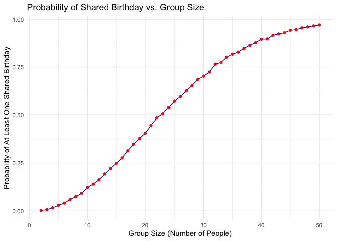
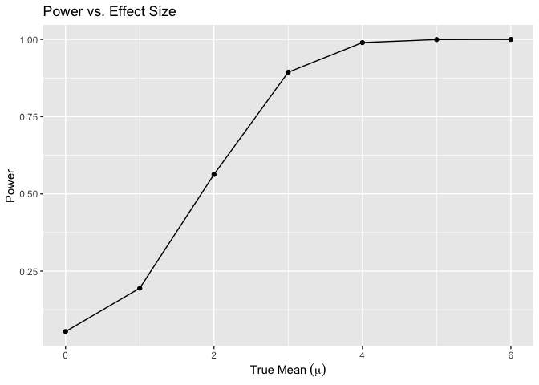
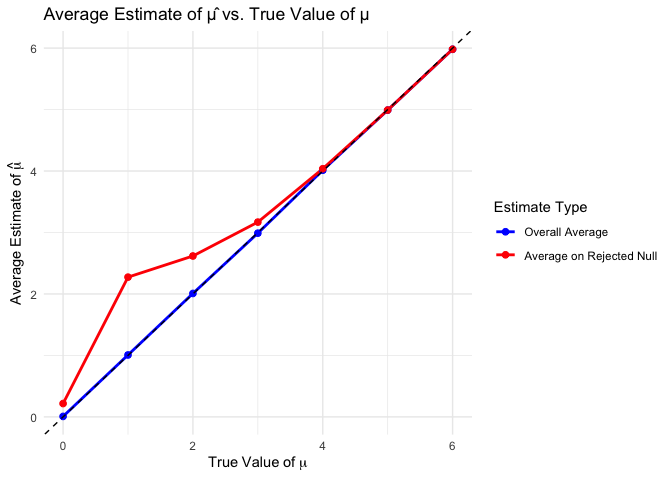
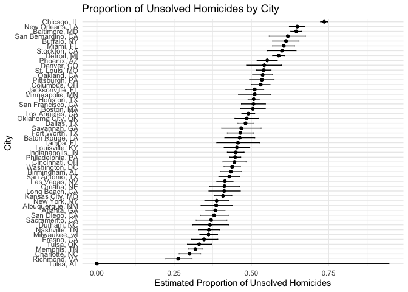

p8105_hw5_am6594
================
Alice Mao
2024-11-15

``` r
# Load necessary libraries
library(broom)
library(ggplot2)
library(tidyr)
library(dplyr)
```

    ## 
    ## Attaching package: 'dplyr'

    ## The following objects are masked from 'package:stats':
    ## 
    ##     filter, lag

    ## The following objects are masked from 'package:base':
    ## 
    ##     intersect, setdiff, setequal, union

``` r
library(purrr)
```

# Problem 1

``` r
# Write the birthday function
birthday <- function(n) {
  birthdays <- sample(1:365, size = n, replace = TRUE)
  # Check for duplicates
  any(duplicated(birthdays))
}

# Set simulation parameters
group_sizes <- 2:50
num_simulations_q1 <- 10000

# Initialize a vector to store probabilities
probabilities <- numeric(length(group_sizes))

# Loop over each group size
for (i in seq_along(group_sizes)) {
  n <- group_sizes[i]
    results <- replicate(num_simulations_q1, birthday(n))
  # Calculate the probability of at least one shared birthday
  probabilities[i] <- mean(results)
}
```

``` r
# Create a data frame with the results
results_df <- data.frame(
  GroupSize = group_sizes,
  Probability = probabilities
)

# Create the plot that show the probability as a function of group size
ggplot(results_df, aes(x = GroupSize, y = Probability)) +
  geom_line(color = "blue") +
  geom_point(color = "red") +
  labs(
    title = "Probability of Shared Birthday vs. Group Size",
    x = "Group Size (Number of People)",
    y = "Probability of At Least One Shared Birthday"
  ) +
  theme_minimal()
```

<!-- -->

This graph illustrates that as the group size increases, the probability
of a shared birthday also rises, approaching 1. For small group sizes,
specifically fewer than 10 people, the probability of a shared birthday
is quite low, close to zero. However, as the group size grows beyond 10,
the probability begins to increase more noticeably. For larger group
sizes, the probability approaches 1. This indicates that with around 50
people, there is a very high likelihood of at least one shared birthday.
This graph highlights the non-linear nature of probability growth in the
birthday problem, showing that as group size increases, the likelihood
of a shared birthday rises quickly.

# Problem 2

``` r
# Set simulation parameters
n <- 30
sigma <- 5
mu_values <- 0:6
num_simulations <- 5000
alpha <- 0.05

# Store results
results <- data.frame()

# Use loop to repeat the t-test for mu = {1,2,3,4,5,6}
for (mu in mu_values) {
  # Perform t-tests
  sim_data <- replicate(num_simulations, {
    x <- rnorm(n, mean = mu, sd = sigma)
    t_test <- t.test(x, mu = 0)
    tidy_t_test <- tidy(t_test)
    data.frame(
      mu_true = mu,
      mu_hat = mean(x),
      p_value = tidy_t_test$p.value
    )
  }, simplify = FALSE)
  
  # Combine simulation results
  sim_results <- bind_rows(sim_data)
  results <- bind_rows(results, sim_results)
}
```

``` r
# Calculate power for each mu
power_results <- results %>%
  group_by(mu_true) %>%
  summarize(power = mean(p_value < alpha))

# Create a plot of Power vs. Effect Size
ggplot(power_results, aes(x = mu_true, y = power)) +
  geom_line() +
  geom_point() +
  labs(title = "Power vs. Effect Size",
       x = expression(True~Mean~(mu)),
       y = "Power")
```

<!-- -->

The graph illustrates that as the true mean increases, the power of the
test also increases, reaching close to 1 for higher effect sizes. A
lower true mean has relatively low power, indicating a lower probability
of detecting a true effect. This relationship suggests that larger
effect sizes make it more likely to achieve a statistically significant
result, reflecting an increased probability of correctly rejecting the
null hypothesis.

``` r
# Calculate overall average estimate of mu_hat for each mu_true
overall_avg <- results %>%
  group_by(mu_true) %>%
  summarize(avg_mu_hat = mean(mu_hat))

# Calculate average estimate of mu_hat for samples where the null was rejected
rejected_avg <- results %>%
  filter(p_value < alpha) %>%
  group_by(mu_true) %>%
  summarize(avg_mu_hat_rejected = mean(mu_hat))

# Merge the two summaries
avg_estimates <- overall_avg %>%
  left_join(rejected_avg, by = "mu_true")

# Reshape data for plotting
avg_estimates_long <- avg_estimates %>%
  pivot_longer(cols = c(avg_mu_hat, avg_mu_hat_rejected),
               names_to = "Estimate_Type",
               values_to = "Average_mu_hat")

# Create the plot
ggplot(avg_estimates_long, aes(x = mu_true, y = Average_mu_hat, color = Estimate_Type)) +
  geom_line(size = 1) +
  geom_point(size = 2) +
  labs(title = "Average Estimate of μ̂ vs. True Value of μ",
       x = expression(True~Value~of~mu),
       y = expression(Average~Estimate~of~hat(mu)),
       color = "Estimate Type") +
  scale_color_manual(values = c("blue", "red"),
                     labels = c("Overall Average", "Average on Rejected Null")) +
  geom_abline(slope = 1, intercept = 0, linetype = "dashed") +
  theme_minimal()
```

    ## Warning: Using `size` aesthetic for lines was deprecated in ggplot2 3.4.0.
    ## ℹ Please use `linewidth` instead.
    ## This warning is displayed once every 8 hours.
    ## Call `lifecycle::last_lifecycle_warnings()` to see where this warning was
    ## generated.

<!-- -->

The graph shows that the sample average of μ̂ across tests where the null
is rejected (red line) is consistently higher than the overall average
(blue line), especially at lower true values of μ. As the true value of
μ increases, the red line gets closer to the true value but remains
slightly above it. This indicates that the sample average of μ̂ for tests
where the null is rejected tends to overestimate the true value of μ,
especially for lower values. This is likely due to selection bias, where
only tests with stronger effects (higher estimated means) lead to
rejection of the null hypothesis, skewing the average estimate upwards
for rejected tests.

# Problem 3

``` r
# Read the data
homicide_data_raw <- read.csv("data/homicide-data.csv")

# Describe the raw data. 
head(homicide_data_raw)
```

    ##          uid reported_date victim_last victim_first victim_race victim_age
    ## 1 Alb-000001      20100504      GARCIA         JUAN    Hispanic         78
    ## 2 Alb-000002      20100216     MONTOYA      CAMERON    Hispanic         17
    ## 3 Alb-000003      20100601 SATTERFIELD      VIVIANA       White         15
    ## 4 Alb-000004      20100101    MENDIOLA       CARLOS    Hispanic         32
    ## 5 Alb-000005      20100102        MULA       VIVIAN       White         72
    ## 6 Alb-000006      20100126        BOOK    GERALDINE       White         91
    ##   victim_sex        city state      lat       lon           disposition
    ## 1       Male Albuquerque    NM 35.09579 -106.5386 Closed without arrest
    ## 2       Male Albuquerque    NM 35.05681 -106.7153      Closed by arrest
    ## 3     Female Albuquerque    NM 35.08609 -106.6956 Closed without arrest
    ## 4       Male Albuquerque    NM 35.07849 -106.5561      Closed by arrest
    ## 5     Female Albuquerque    NM 35.13036 -106.5810 Closed without arrest
    ## 6     Female Albuquerque    NM 35.15111 -106.5378        Open/No arrest

The Washington Post’s dataset on homicides in 50 large U.S. cities
includes records collected from 2015 onward. The dataset contains
information of uid, reported_date, victim_last, victim_first,
victim_race, victim_age, victim_sex, city, state, lat, lon, disposition.
The data consists of 52179 datasets.

``` r
# Create a city_state variable
homicide_data <- homicide_data_raw %>%
  mutate(city_state = paste(city, state, sep = ", "))

# Define unsolved homicides
unsolved_dispositions <- c("Closed without arrest", "Open/No arrest")

# Summarize total and unsolved homicides within each city
city_summary <- homicide_data %>%
  group_by(city_state) %>%
  summarize(
    total_homicides = n(),
    unsolved_homicides = sum(disposition %in% unsolved_dispositions)
  )

# Print the result
city_summary
```

    ## # A tibble: 51 × 3
    ##    city_state      total_homicides unsolved_homicides
    ##    <chr>                     <int>              <int>
    ##  1 Albuquerque, NM             378                146
    ##  2 Atlanta, GA                 973                373
    ##  3 Baltimore, MD              2827               1825
    ##  4 Baton Rouge, LA             424                196
    ##  5 Birmingham, AL              800                347
    ##  6 Boston, MA                  614                310
    ##  7 Buffalo, NY                 521                319
    ##  8 Charlotte, NC               687                206
    ##  9 Chicago, IL                5535               4073
    ## 10 Cincinnati, OH              694                309
    ## # ℹ 41 more rows

``` r
# Filter Baltimore dataset
baltimore_data <- city_summary %>%
  filter(city_state == "Baltimore, MD")

# Perform prop.test to estimate the proportion of homicides that are unsolved
baltimore_test <- prop.test(
  x = baltimore_data$unsolved_homicides,
  n = baltimore_data$total_homicides
)

# Apply the broom::tidy and pull the estimated proportion and confidence intervals 
baltimore_results <- tidy(baltimore_test) %>%
  select(estimate, conf.low, conf.high)

# Print the result
baltimore_results
```

    ## # A tibble: 1 × 3
    ##   estimate conf.low conf.high
    ##      <dbl>    <dbl>     <dbl>
    ## 1    0.646    0.628     0.663

``` r
# Perform prop.test for each city
city_tests <- city_summary %>%
  mutate(
    test_results = map2(
      unsolved_homicides,
      total_homicides,
      ~ prop.test(x = .x, n = .y)
    )
  )
```

    ## Warning: There was 1 warning in `mutate()`.
    ## ℹ In argument: `test_results = map2(...)`.
    ## Caused by warning in `prop.test()`:
    ## ! Chi-squared approximation may be incorrect

``` r
# Extract the proportion of unsolved homicides and the confidence interval
city_results <- city_tests %>%
  mutate(
    tidy_results = map(test_results, ~ tidy(.x))
  ) %>%
  unnest(tidy_results) %>%
  select(
    city_state,
    estimate,
    conf.low,
    conf.high
  )

# Print the result
city_results
```

    ## # A tibble: 51 × 4
    ##    city_state      estimate conf.low conf.high
    ##    <chr>              <dbl>    <dbl>     <dbl>
    ##  1 Albuquerque, NM    0.386    0.337     0.438
    ##  2 Atlanta, GA        0.383    0.353     0.415
    ##  3 Baltimore, MD      0.646    0.628     0.663
    ##  4 Baton Rouge, LA    0.462    0.414     0.511
    ##  5 Birmingham, AL     0.434    0.399     0.469
    ##  6 Boston, MA         0.505    0.465     0.545
    ##  7 Buffalo, NY        0.612    0.569     0.654
    ##  8 Charlotte, NC      0.300    0.266     0.336
    ##  9 Chicago, IL        0.736    0.724     0.747
    ## 10 Cincinnati, OH     0.445    0.408     0.483
    ## # ℹ 41 more rows

``` r
# Organize cities according to the proportion of unsolved homicides.
plot_data <- city_results %>%
  arrange(estimate) %>%
  mutate(city_state = factor(city_state, levels = city_state))

# Create a plot that shows the estimates and CIs for each city
ggplot(plot_data, aes(x = city_state, y = estimate)) +
  geom_point() +
  geom_errorbar(aes(ymin = conf.low, ymax = conf.high), width = 0.2) +
  coord_flip() +
  labs(
    title = "Proportion of Unsolved Homicides by City",
    x = "City",
    y = "Estimated Proportion of Unsolved Homicides"
  ) +
  theme_minimal()
```

<!-- -->
